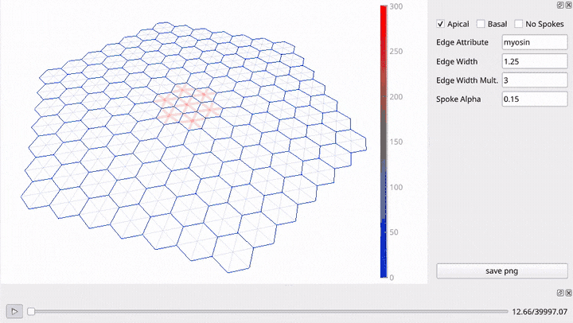

## VertexTissue
Vertex-based Tissue modelling in 2D/3D.



## About
This repository contains code that can be used in Vertex Model simulations of tissue mechanics (see example above). It is fork of the code developed by:
* [Clinton H. Durney](https://clintondurney.github.io/)

The python package `VertexTissue` extends and improves that code in the following ways:
+ It allows for viscoelastic dissipation in the cell-edges:
	* using either Maxwell Model or Standard Linear Solid Model elements
+ Significant improvements to performance (~100-fold faster):
	* Jit-compilation of core numerical routines (using `numba`)
	* Simplification of some core loops and optimization of datatypes
+ Cell-volumes are computed using an exact formula rather than the quickhull algorithm (requires the use of the `fastvol=True` during integration).
+ Adaptive timestepping that detects large force differences and keeps deformations below user-specified thresholds. 

The code contained herein was written for the simulations in the following publication:

*Stress-relaxation in a self-constricting model of tubulogenesis during Drosophila salivary gland invagination*


## Dependencies

Plotting the tissue geometry uses OpenGL and requires the `OpenGL Utility Toolkit`. This can be obtained from the `freeglut` package,  on debian-based Linux distributions this can usually be installed using:
```
sudo apt install freeglut*
```

## Installation ### 

Clone this repo locally, create/activate any relevant virtual environments, and then run :
```
pip install .
```

You may also add the `-e` flag to install as an editable project or alternatively use any other installation tool that is compatible with a `pyproject.toml` specification file.

## Example

Run `main.py` in the root folder of this repository.

```
python main.py
```

## Package Overview

A more in-depth description of the package and its features/options can be found [here](OVERVIEW.md).

## Unit-Tests

A number of unit-test have been implemented (using the [pytest](https://pytest.org/) framework) to verify the correctness of of the implementation of certain forces. To run these test, simply run 
``` 
pytest
```
in the root directory of this repository.

This test suite should be re-run after any modification to force-related code.